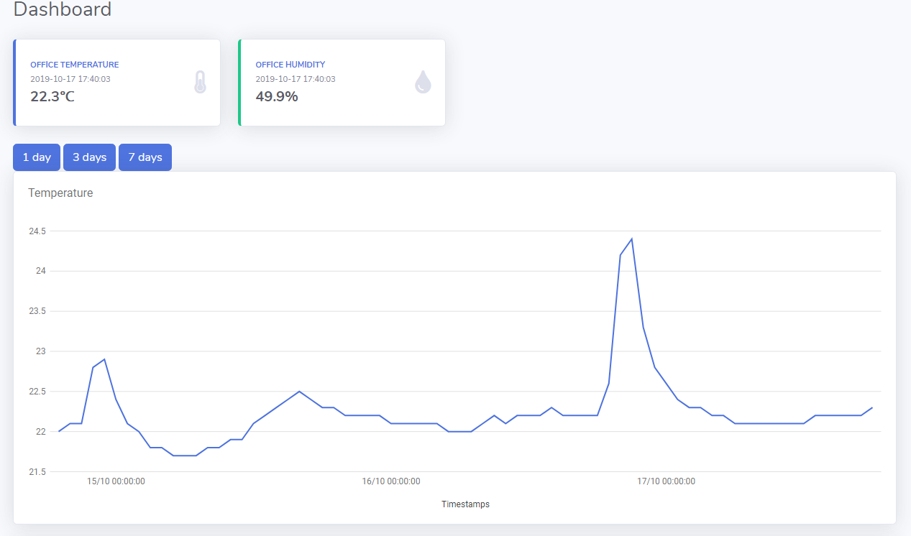

# Walter server
[](https://travis-ci.com/frangiz/walter-server)
[](https://img.shields.io/github/license/frangiz/walter-server.svg)

The server for Walter written in Python.

## Dashboard


## Getting started
Install the requirements using pip
```
pip install -r requirements-dev.txt
```
Create the database with
```
flask db init
```
Start the application with
```
flask run
```

## Useful curls
### Post a temperature reading
```
curl -X POST http://127.0.0.1:5000/api/temperature \
  -H 'Content-Type: application/json' \
  -d '{
	"timestamp": 1571327874,
	"sensor": "my-sensor-1",
	"value": 22.1,
	"next_update": 720
}'
```

### Get all sensors
```
curl -X GET http://127.0.0.1:5000/api/sensors
```

### Get last reading for a sensor
```
curl -X GET http://127.0.0.1:5000/api/sensors/my-sensor-1/readings/last
```

### Get all readings for a sensor 5 days back
```
curl -X GET 'http://127.0.0.1:5000/api/sensors/my-sensor-1/readings?days_back=5'
```

## Database

### After a complete reset of the database
```
flask db init
```

### Create migration files after the models have been changed
```
flask db migrate -m "<message>"
```

### Upgrade a database
```
flask db upgrade
```